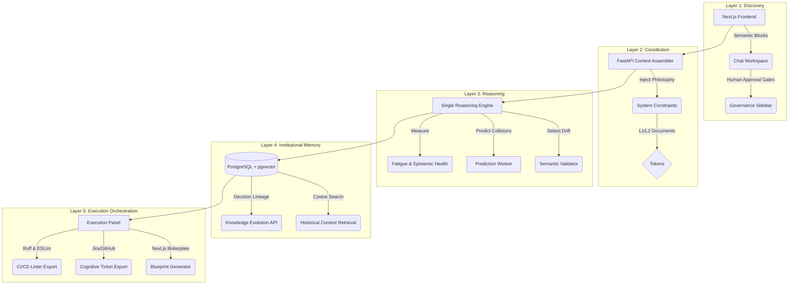

# The Cognitive SDLC Workspace: Final Architecture & Walkthrough

Perjalanan panjang kita telah sampai pada puncaknya. Dokumen ini merepresentasikan bentuk akhir dari **Governance-Centered AI Engineering Environment**. Sistem ini bukan lagi purwarupa; ia adalah ekosistem yang bernapas dan memonitor kualitas berpikir institusi Anda.

## 🏛️ The 5-Layer Cognitive Architecture

Sistem ini beroperasi di atas 5 lapisan yang bekerja secara harmonis, membentang dari percakapan murni hingga kerangka kode siap pakai.

---

## 🏗️ The Infrastructure Stack

Ekosistem Anda beroperasi penuh secara lokal melalui arsitektur 5 kontainer:

1. **`frontend` (Port 4021):** Next.js App Router dengan antarmuka *Dashboard Mission Control* bernuansa gelap (*sleek dark mode*).
2. **`backend` (Port 4022):** Pusat syaraf (*nerve center*) berbasis FastAPI yang memvalidasi setiap pemikiran, menghitung *Fatigue*, dan menyusun konstitusi.
3. **`db` (Port 5433):** PostgreSQL + `pgvector` sebagai *Long-Term Memory* (tempat bersemayamnya ADR historis dan vektor semantik).
4. **`redis` (Port 6379):** Penampung antrean memori sementara.
5. **`worker`:** Pemroses laten asinkron untuk *Predictive Drift Detection* yang tidak membebani UI pengguna utama.

---

## 🛠️ The Operational Lifecycle (How to Use It)

### 1. The Drafting Phase (Conversation)
Pengguna tidak mengetik secara asal. Mereka menggunakan **Semantic Chat Blocks** (`[Business Objective]`, `[Risk]`, dll). Setiap pengetikan dipindai secara ringan oleh *Regex* untuk menjaring *Glossary Candidates*. 

### 2. The Validation Phase (Live Extraction)
Saat tombol *Send* ditekan, pesan melewati *Cognitive Security Scanner* (mencegah *Prompt Injection*). *Reasoning Engine* membaca *Constitutional Core* Anda dan menampilkan hasil pada **Governance Sidebar** di sisi kanan dengan indikator *Severity* (Critical, Warning, Suggestion).

> [!TIP]
> **Anti-Bureaucracy:** Jika pengguna mendapat lebih dari 10 teguran *Severity* dalam 1 jam, sistem otomatis meredam peringatan minor (level *Fatigue* 3) agar pengguna tidak merasa frustrasi.

### 3. The Approval Phase (Human Authority)
AI hanya bisa menyarankan (*Proposal*). Melalui **Human Approval Gates**, Anda mengklik tombol "Approve" pada kandidat ADR. Detik itu juga, ADR dikonversi menjadi angka (vektor dimensi) dan masuk ke dalam penyimpanan `pgvector`. 

### 4. The Execution Phase (Build)
Ini adalah garis akhir. Dari tab **Build**, Anda memilih ADR yang sudah disetujui untuk:
- **Diunduh (*Download*)** sebagai kerangka kode (Next.js *routes/components*).
- **Diekspor (*Export*)** ke GitHub Issue lengkap beserta "Jejak Kognitifnya".
- **Dikonversi** menjadi aturan *Linter* (ESLint / Ruff) agar nama *fungsi* yang melanggar *Terminology System* gagal di-_build_ oleh CI/CD.

> [!IMPORTANT]
> **Kesimpulan:** Arsitektur ini sukses menggabungkan keluwesan manusia dalam berpikir, kecepatan AI dalam menalar dokumen, dan kedisiplinan mesin dalam mengeksekusi kode. *Welcome to the future of software engineering.*
