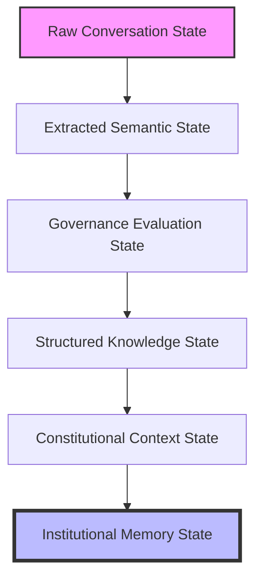

# COGNITIVE SYSTEMS ARCHITECTURE

**"The Epistemological Operating Model"**

Dokumen ini memetakan arsitektur kecerdasan dan tata kelola framework ini. Berbeda dengan arsitektur sistem perangkat lunak konvensional (MVC, Microservices, dsb.), ini adalah peta tentang bagaimana *pemikiran, penalaran, dan aturan* mengalir dari percakapan manusia hingga menjadi hukum sistem yang abadi.

---

## 1. THE 4 COGNITIVE ENGINES (4 Mesin Kognitif Utama)

Framework ini ditenagai oleh 4 Mesin Penalaran Utama yang bekerja berkesinambungan (sebagai *Operational Cognitive Loop*):

### A. DISCOVERY COGNITION ENGINE (AI System Analyst)
Mesin ini beroperasi di garda terdepan saat berinteraksi dengan manusia. Ia tidak menerima permintaan mentah (*raw prompt*) sebagai instruksi final. 
*   **Fungsi:** Mengklarifikasi ambiguitas, mendeteksi *Domain Signals* (implikasi hukum, risiko, dan otoritas), serta memancing *Governance Signals* yang tersembunyi dari percakapan pengguna. 
*   **Sifat:** *Suspicious by default* (Skeptis terhadap ketidakjelasan).

### B. STRUCTURED KNOWLEDGE ENGINE (The Heart of Framework)
Mesin yang bertugas mencegah percakapan berharga menguap menjadi sekadar *chat history* sementara.
*   **Fungsi:** Mengonversi sinyal kognitif menjadi luaran artefak terstruktur (e.g. *Process Models*, *Categorized Risk Maps*, *Machine-Readable Business Rules*). 
*   **Sifat:** Transformatif (menciptakan struktur dari kekacauan percakapan linguistik).

### C. GOVERNANCE REASONING ENGINE (The Validator)
Mesin ini adalah "Hakim Konstitusi". Alih-alih melakukan generasi teks, mesin ini mengevaluasi struktur yang dihasilkan.
*   **Fungsi:** Menilai kelengkapan tata kelola (*Governance Completeness Check*), mencari otoritas yang tidak terdefinisi (*Authority Gap Detection*), serta mendeteksi *Architecture Drift* jika fitur baru berbenturan dengan modul lama.
*   **Sifat:** Kritis dan Defensif (Melindungi memori institusional).

### D. CONTEXT CONSTITUTION ENGINE (The Shield of Truth)
Komponen yang secara spesifik dirancang untuk mengatur apa yang AI "ketahui" pada satu detik perakitan *prompt*.
*   **Fungsi:** Mengambil *Relevant Context*, menyuntikkan *Governance Constraints*, dan memaksakan *Priority Order* kepada LLM internal sebelum *output reasoning* dilakukan.
*   **Sifat:** Regulatif (Memastikan AI tidak berpikir tanpa batas).

---

## 2. COGNITIVE STATE MODEL (Model Evolusi Pengetahuan)

Data di dalam sistem ini tidak statis. Ia bermutasi dan menua (*decay*) melewati berlapis fase kognitif. Transformasi state ini wajib dipelihara (*Cognitive Tracing*):



*   **Raw Conversation:** Ucapan pengguna (kacau, ambigu, berbasis intensi sesaat).
*   **Extracted Semantic:** Terminologi yang mulai dikenali oleh *Discovery Engine*.
*   **Governance Evaluation:** *Draft* aturan yang di-uji benturannya dengan aturan lama.
*   **Structured Knowledge:** ADR dan dokumen yang valid menunggu penetapan persetujuan manusia.
*   **Constitutional Context:** Saat pengetahuan divalidasi manusia dan aktif sebagai "konteks masa depan" (*Active Governance*).
*   **Institutional Memory:** Memori operasional jangka panjang yang menjadi fondasi bagi tim pengembang lintas-generasi.

---

## 3. GOVERNANCE KNOWLEDGE FLOW (Alur Pengetahuan Tata Kelola)

Bagaimana komponen pengetahuan (*knowledge*) diikat menjadi intelijensi organisasional (Relational Knowledge Model):

```text
[ADR] 
  ├── is constrained by ── [Business Rules]
  ├── mitigates ────────── [Identified Risk]
  ├── impacts ──────────── [System Workflow]
  ├── resides in ───────── [Module Boundary]
  └── is approved by ───── [Human Actor Authority]
```

Tidak ada satu entitas pun (*Artifact*) yang berdiri sendiri. Setiap *Business Rule* harus terkait dengan sebuah *Actor*, dan setiap *Actor* memiliki tanggung jawab terhadap suatu rentang *Workflow*.

*Arsitektur ini memastikan bahwa framework beroperasi sebagai "Reasoning Infrastructure" dan bukan sekadar lemari arsip teks.*
